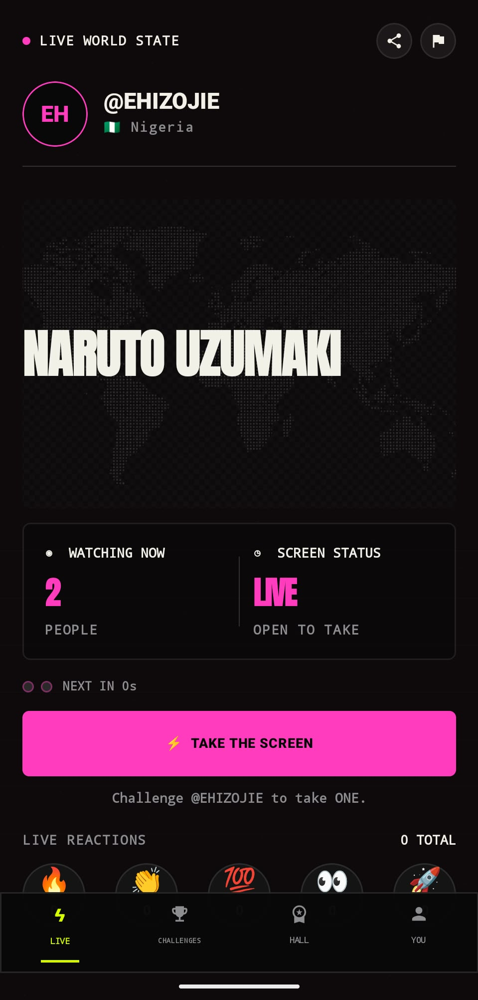
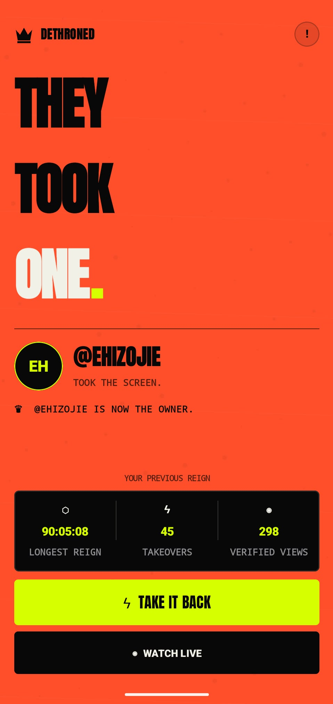
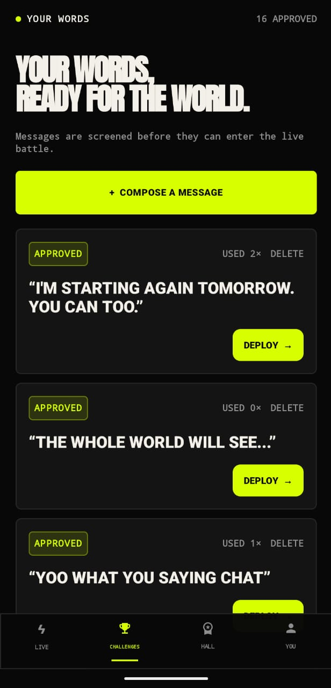
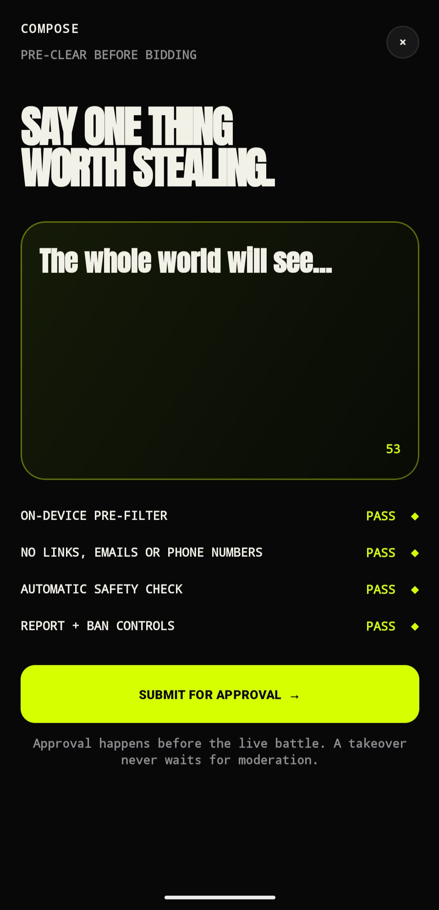
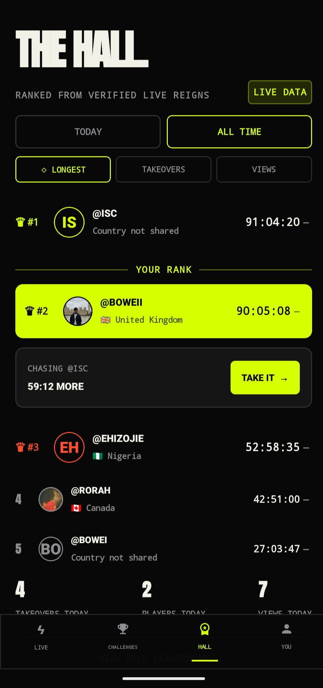
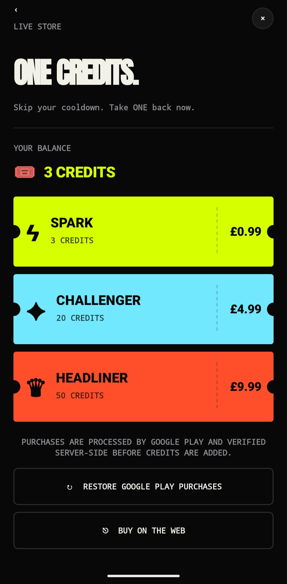

<div align="center">


# ONE

### One screen. One message. Your turn.

**What if everyone opening an app saw the same message—and anyone could take its place?**

[Explore the website](https://oneis.live) · [Run it locally](#run-one) · [Under the hood](#two-people-press-take-only-one-can-win) · [Contribute](#build-with-me)

Native Android · Kotlin + Jetpack Compose · Supabase · RevenueCat · OneSignal

</div>

---

## You don't scroll past it. You take it.

A thought someone needed to hear. A joke that deserves its moment. A completely ridiculous battle between friends.

ONE gives them the same stage: **one shared live message, with one current owner**. Take the screen and your words go live. Someone else can take it next.

No feed to disappear into. No follower count deciding whose turn it is. Just your words, the people watching, and the next person with something to say.

**You can come here to compete. You can also just have something to say.**

## Meet ONE

Actual app captures. No device frames. No invented audience numbers.

<table>
<tr>
<td align="center" width="33%"><strong>The shared screen</strong><br/></td>
<td align="center" width="33%"><strong>The moment you lose it</strong><br/></td>
<td align="center" width="33%"><strong>Your next words</strong><br/></td>
</tr>
</table>

<details>
<summary><strong>See the compose flow, Hall and credit store</strong></summary>
<br/>
<table>
<tr>
<td align="center" width="33%"><strong>Approve before going live</strong><br/></td>
<td align="center" width="33%"><strong>A place for your reign</strong><br/></td>
<td align="center" width="33%"><strong>Skip the wait</strong><br/></td>
</tr>
</table>
</details>

## Before the code, there was a WhatsApp group

I'm Bowei, a computer science student. Before building ONE, I ran the idea by hand: one message, one owner, and friends trying to take it from each other. I announced the ownership changes myself.

**58 takeover attempts. 28 minutes.**

That experiment changed the plan. Charging for every takeover would interrupt the very thing people were enjoying: the speed, the rivalry, and the chance to put their words in front of everyone.

Public feedback changed the design, too. Losing the only screen was originally a small system notice. It became the full-screen orange-red **Dethroned** state—because that moment is the story, not an interruption to it.

ONE is built around a subtraction: remove the feed, and the message has nowhere to hide.

## How your words go live

1. **Write first.** Compose a message and submit it for approval before it can enter the live battle.
2. **Take the screen.** Choose an approved message and attempt a takeover.
3. **Go live.** A successful takeover replaces the shared message and starts a new reign.
4. **Feel the change.** The previous owner is dethroned; targeted notifications give them a reason to return.
5. **Make your next move.** React, watch, check the Hall, or take it back.

### Money buys impatience—not permanent ownership

Taking the screen is free when your cooldown is ready. During the wait, **one ONE Credit** can fund a successful cooldown skip. A rewarded ad offers a separate, server-verified skip where configured.

- Paying does not improve your odds or protect your reign.
- Failed or stale takeovers spend no credits.
- Someone else can still take the screen from you.
- RevenueCat powers purchases; server-side verification grants the credits.
- The RevenueCat/Stripe web funnel links a purchase to the player's account rather than asking them to type an ID.

See [ECONOMY.md](ECONOMY.md) for pack sizes, ad limits and legacy identifiers. Some internal fields still use `tickets`; the current user-facing currency is **ONE Credits**.

## Two people press Take. Only one can win.

The interaction is simple. The rules behind it need to be precise.

```text
Two takeover requests → one authoritative database transaction
                      → one winner / one new reign
                      → stale loser / no credit spent
```

Configured multiplayer builds use a shared Supabase state—not a client-side illusion of a global screen.

| Product promise | Implementation |
| --- | --- |
| One current owner | Atomic `take_one` transaction and monotonic reign sequence |
| No charge for losing a race | Stale-reign checks and transactional credit spending |
| Retries aren't another purchase | Idempotent request IDs, ledger entries and webhook deduplication |
| Words are ready before the battle | Pre-screened message library and moderation workflow |
| Notifications reach the right player | OneSignal external identity tied to the Supabase player UUID |
| Audience numbers have a source | Recorded app/web views and watcher heartbeats |

### A broadcast, not another feed

Near-black surfaces. Condensed headlines. Monospaced operational text. A high-contrast accent tied to the live state.

The owner and message come first. Status comes second. One primary action stays visible. Ownership changes are events: a takeover transition in, a Dethroned state out.

The public website extends the idea into a wall of matching screens: the same message, repeated at a scale a phone cannot show.

## Run ONE

### Android

Requirements: Android Studio, JDK 17, Android SDK 36, and an emulator or device running Android 8.0/API 26 or newer.

```bash
git clone https://github.com/Boweii22/ONE.git
cd ONE
```

1. Open the repository in Android Studio and configure your local Android SDK.
2. Register your own Firebase Android app for `com.tomribowei.one` and put its downloaded `google-services.json` in `app/`. This file is intentionally excluded from Git; the Google Services build plugin expects it.
3. Add your own public client settings to your user-level `~/.gradle/gradle.properties` or the repository's ignored `local.properties`:

```properties
SUPABASE_URL=https://YOUR_PROJECT.supabase.co
SUPABASE_ANON_KEY=YOUR_PUBLIC_CLIENT_KEY
REVENUECAT_API_KEY=YOUR_PUBLIC_ANDROID_SDK_KEY
ONESIGNAL_APP_ID=YOUR_ONESIGNAL_APP_ID
ONE_WEB_URL=https://oneis.live
ONE_WEB_FUNNEL_URL=YOUR_REVENUECAT_FUNNEL_URL
GOOGLE_WEB_CLIENT_ID=YOUR_GOOGLE_WEB_CLIENT_ID
```

4. Run the `app` configuration, or build and run unit tests:

```powershell
.\gradlew.bat testDebugUnitTest assembleDebug
```

On macOS/Linux, use `./gradlew testDebugUnitTest assembleDebug`.

Debug APK: `app/build/outputs/apk/debug/app-debug.apk`.

> Without Supabase settings, the debug app uses labelled **LOCAL DEMO MODE**. This is for local design review, not global multiplayer. Release builds require live Supabase settings and your own signing setup.

### Web spectator

Requirements: Node.js 22.13 or newer. The client uses React and Vinext.

```bash
cd web
npm install
```

Copy `.env.example` to `.env.local`, fill in your own values, then:

```bash
npm run dev
```

For linting and a production build:

```bash
npm run lint
npm run build
```

Only public Supabase client values belong in browser configuration. Keep server-only environment variables on the server.

### Backend and integrations

Follow [DEPLOYMENT.md](DEPLOYMENT.md) to provision your own Supabase instance, apply migrations and connect RevenueCat and OneSignal. See [MONETIZATION-SETUP.md](MONETIZATION-SETUP.md) for purchase configuration.

Use your own backend when developing. A fork is not permission to run automated tests against the public game.

## Verify the race, not just the animation

Against **your own test backend**, set `SUPABASE_URL` and `SUPABASE_ANON_KEY` in the process environment and run:

```bash
node scripts/live-race-test.mjs
```

This integration test creates disposable players and sends competing takeover requests. It checks for one winner, a `STALE_REIGN` loser, unchanged loser balance and a sole recorded owner. It mutates the test game state; do not point it at shared production.

Database tests are also included:

```bash
supabase test db
```

## Inside the repository

```text
app/                    Kotlin + Jetpack Compose Android client
supabase/migrations/    Authoritative game state, economy and access rules
supabase/functions/     Purchase grants, notifications, moderation and ad rewards
supabase/tests/         Database contract tests
scripts/                Live race and handle-policy verification
web/                    Public spectator website
docs/assets/            README screenshots from the current UI
```

Further reading: [Deployment](DEPLOYMENT.md) · [Economy](ECONOMY.md) · [Playtesting](PLAYTEST.md) · [Backend](PRODUCTION_BACKEND.md) · [Integration readiness](INTEGRATION-READINESS.md)

## A shared screen needs shared responsibility

ONE is public user-generated content. Pre-screening, contact-detail filtering, reports, rate limits, moderation workflows and an emergency kill switch are part of the system—not a guarantee that harmful content can never appear.

Operating a public instance also requires human review, abuse monitoring, published community rules, a safety contact and workable ban/appeal procedures.

**Never commit service-role keys, RevenueCat secret keys, OneSignal REST keys, webhook secrets, signing keys or credentials.** Public client identifiers are not server secrets. Report suspected vulnerabilities privately rather than publishing an exploit or player data in an issue.

## Build with me

Useful contributions are welcome: clearer onboarding, accessibility improvements, Android UI polish, reproducible race bugs, moderation edge cases, tests and documentation.

- For a bug, include the build version, reproduction steps and expected versus actual behaviour. Remove private data from logs and screenshots.
- For a larger change, open an issue first so we can agree on scope.
- For a pull request, explain the behaviour change, include relevant tests and show screenshots if the UI changes.

If the idea makes you curious, **star the repository**, share it with someone who has something to say, or open an issue with what you would improve. Small, specific feedback helped shape ONE in the first place.

Built by **[Bowei](https://github.com/Boweii22)** for RevenueCat Shipaton 2026. Source code is available under the [MIT License](LICENSE).

---

<div align="center">

**What would you put on ONE?**

[oneis.live](https://oneis.live)

</div>
